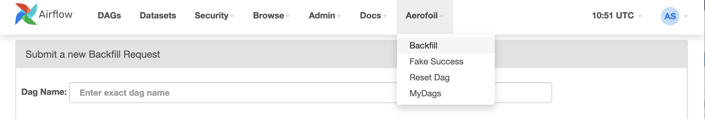
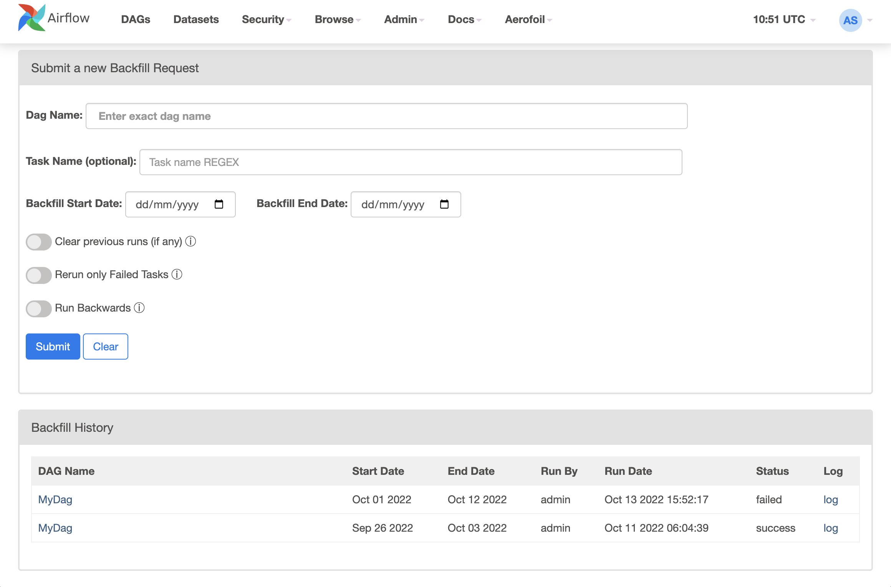
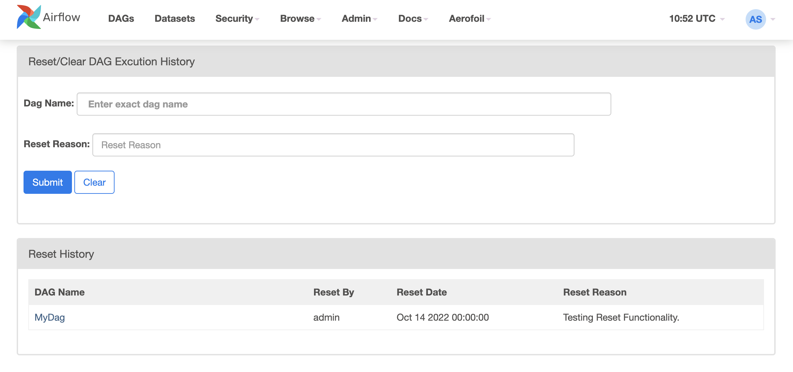

# Aerofoil : Lifting Airflow
Aerofoil is an Apache Airflow plugin. It provides some very useful extensions, that are missing in the Airflow. The plugin is available with MIT license, the intention is to keep it simple and friendly. 

### Features:
##### Backfill UI: 
A convenient way to run Backfill DAG from UI. In most of the enterprise setup, DAG developers do not have access to Airflow servers to be able to run backfill jobs. This makes running backfill an expensive operation. With the Backfilll UI, Airflow users can submit backfill command from UI. The backfill itself runs as a Airflow DAG and is compatible with most production Airflow configurations. This is also the most used feature in Aerofoil.
##### My DAGs
Large Airflow installations can have hundreds of DAGs. This feature allows logged in user to view to see the DAG's authored by her/him. The DAG Author must be set correctly in the DAG file and it must match with the Airflow user name. 
##### Reset DAG History
Sometime complete DAG history needs to be reset. There is currently no way of clearing a DAGs history in Airflow. This functionality allows clearing/resetting DAGs history via a convenient UI.  

##### Fake Sucess
A shortcut to mark your DAG/Task runs successful. The Fake success is a powerful featurs, and to avoid misuse and Audit Trail is maintained. Adminstratos can always find out, who is trying to fake it. 

##### AerofoilBashOperator: 
Context aware BashOperator, that can take a context and pass it to callback e.g. `on_success_callback`, `on_failure_callback` etc. 

## Installation 
### Pre-requisite
- Working Airflow installation.
- works with any executor other than Sequential Executor or LocalExecutor (e.g. KubernetasExecutor, CeleryExecutor)
- Requires a non-sqlite database in the backend.

### Install Instructions:
- pip install apache-airflow-providers-aerofoil
- Add rquired tables to Airflow Metadata DB by executing src/aerofoil/models.sql
- Deploy DAG file in the src/aerofoil/aerofoil_backfill.py DAGs to  your Airflow (usually by putting the DAG in  Airflow's DAGs folder.
- Make sure the *__aerofoil_backfill__*  DAG is enabled.

## Backfilll Design:
When the user submits a backfill, it creates an entry in the `aerofoil_backfill` backfill table. *__aerofoil_backfill__*  DAG is scheduled to run every minute (which can be changed, by modifying the DAG). The Sesor in the DAG, picks up the entries in the DB and create dynamic task for each entry. The Backfill job itself runs as a Bash command in the executor. This provides a flexible and executor agnostic design.  

## Screenshots:
##### Aerofoil Menu

##### Backfill Screen

##### Reset DAG Menu

##### Fake Success Menu

## Contribute:
If you find something missing and would like to contrinute, feel free to raise a pull request. If you find a bug and would like me to fix it, please feel free to raise an issue. 
